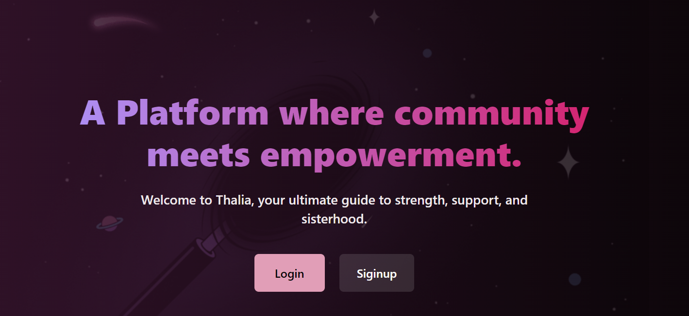

    <picture>
    
    </picture>

    
    
    
        
        
    
    
    

<h4 align="center">
    

        <a href="https://thalia.vercel.app/">Official website</a> |
        <a href="">Presentation Video</a>
    

</h4>

Thalia is a cutting-edge website designed to empower women in every aspect of their lives. From career guidance to wellness tips, Thalia harnesses the power of AI 🤖 to deliver personalized assistance and insights.

## Features

- **Personalized Assistance:** Thalia utilizes AI technologies to provide personalized guidance and support tailored to each user's needs and preferences.
- **Career Guidance:** Empower women in their career paths by providing resources, advice, and opportunities for growth and development.
- **Wellness Tips:** Promote holistic well-being by offering tips, articles, and resources related to physical, mental, and emotional health.
- **AI-powered Chatbot:** Integration of a chatbot powered by OpenAI and Hugging Face models to provide real-time assistance and support.
- **Toxicity Estimation:** Detect and mitigate toxic comments through AI-powered analysis, creating a safe and supportive online community.

### UI demo

    <picture>
    
    </picture>

## Technologies Used

- **Frontend:** React.js, TailwindCSS, Redux
- **Backend:** Express.js, Node.js
- **Database:** MongoDB
- **Chat Bot:** Django Rest API
- **AI models:** Huggingface and OpenAI

## Core Contributers

<table>
  <tbody>
    <tr>
      <td valign="top" width="14.28%"><a href="https://github.com/izam-mohammed"> <b>Izam Mohammed</b></a> 
      </td>
      <td valign="top" width="14.28%"><a href="https://github.com/Sreesanjay"> <b>Sreesanjay</b></a> 
      </td>
      <td valign="top" width="14.28%"><a href="https://github.com/SHUHAIB-T"> <b>Shuahib TU</b></a> 
      </td>
      <td valign="top" width="14.28%"><a href="https://github.com/amarnath-dev"> <b>Amarnath AS</b></a> 
      </td>

</tr>
</tbody>

</table>

## Deployment

Thalia is successfully hosted on Vercel. You can access the live site [thalia.vercel.app](https://thalia.vercel.app/).

## Contributing

If you're interested in contributing to Thalia, please read the [CONTRIBUTING.md](CONTRIBUTING.md) file for guidelines and instructions.

## License

This project is licensed under the MIT License - see the [LICENSE.md](LICENSE.md) file for details.

## Acknowledgements

- Special thanks to all contributors and supporters who help make Thalia a reality.
